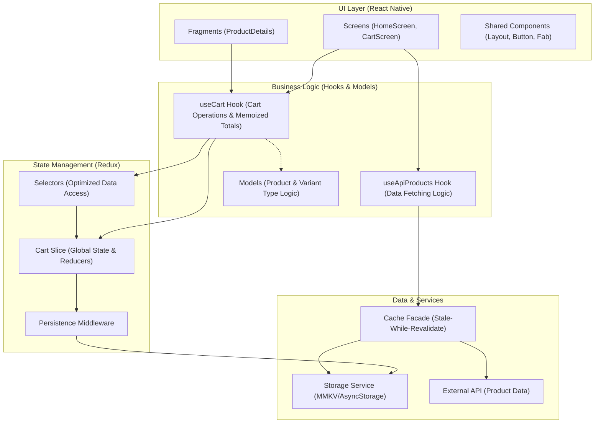

This is a new [**React Native**](https://reactnative.dev) project, bootstrapped using [`@react-native-community/cli`](https://github.com/react-native-community/cli).

# Getting Started

> **Note**: Make sure you have completed the [Set Up Your Environment](https://reactnative.dev/docs/set-up-your-environment) guide before proceeding.

## Step 1: Install dependencies

```sh
# Using npm
npm install

# OR using Yarn
yarn install
```

## Step 2: Start Metro

First, you will need to run **Metro**, the JavaScript build tool for React Native.

To start the Metro dev server, run the following command from the root of your React Native project:

```sh
# Using npm
npm start

# OR using Yarn
yarn start
```

## Step 3: Build and run your app

With Metro running, open a new terminal window/pane from the root of your React Native project, and use one of the following commands to build and run your Android or iOS app:

### Android

```sh
# Using npm
npm run android

# OR using Yarn
yarn android
```

### iOS

For iOS, remember to install CocoaPods dependencies (this only needs to be run on first clone or after updating native deps).

The first time you create a new project, run the Ruby bundler to install CocoaPods itself:

```sh
bundle install
```

Or you can also use:

```sh
npx pod-install
```

For more information, please visit [CocoaPods Getting Started guide](https://guides.cocoapods.org/using/getting-started.html).

```sh
# Using npm
npm run ios

# OR using Yarn
yarn ios
```

If everything is set up correctly, you should see your new app running in the Android Emulator, iOS Simulator, or your connected device.

This is one way to run your app — you can also build it directly from Android Studio or Xcode.

## Step 4: Modify your app

Now that you have successfully run the app, let's make changes!

Open `App.tsx` in your text editor of choice and make some changes. When you save, your app will automatically update and reflect these changes — this is powered by [Fast Refresh](https://reactnative.dev/docs/fast-refresh).

When you want to forcefully reload, for example to reset the state of your app, you can perform a full reload:

- **Android**: Press the <kbd>R</kbd> key twice or select **"Reload"** from the **Dev Menu**, accessed via <kbd>Ctrl</kbd> + <kbd>M</kbd> (Windows/Linux) or <kbd>Cmd ⌘</kbd> + <kbd>M</kbd> (macOS).
- **iOS**: Press <kbd>R</kbd> in iOS Simulator.

## Congratulations! :tada:

You've successfully run and modified your React Native App. :partying_face:


## High-level architecture diagram



- **UI Layer**: Composed of Screens and reusable Components. It remains decoupled from raw data by interacting only with custom hooks.
- **Logic Layer**: Hooks handle side effects and data transformation. Memoization at this level ensure the UI only re-renders when necessary.
- **State Layer**: Redux toolkit manages global state. A dedicated middleware ensures the cart state is synchronized with persistent storage on every change.
- **Data Layer**: A caching facade manages the "offline-first" strategy, prioritizing local storage when network requests fail.

## Notable tradeoffs and assumptions

- **State Management & Persistence**: I chose to centralize the shopping cart state in **Redux** rather than local component state. This ensures that the cart is consistent across screens and persists between sessions via a custom `persistenceMiddleware` and `storageService`.
- **Custom Icon System**: Instead of adding a large icon library dependency, I implemented a custom SVG-based icon system in `icons.tsx`. This provides full control over the icon paths, stroke width, and visual centering (especially for asymmetrical icons like the shopping cart).
- **Hook Performance Optimization**: In the `useCart` hook, I implemented a pattern where accessor functions (`getCartItemsData()`, `getTotal()`) return values pre-calculated via `useMemo`. This allows the UI to stay clean and reactive while ensuring heavy mapping or reduction logic only executes when the cart state objectively changes.
- **API Caching Strategy**: The `cachedApiFacade` assumes that providing potentially stale data from storage is preferable to showing an error/loading screen if the network request fails, prioritizing user experience in low-connectivity scenarios.
- **UI Responsiveness**: The layout utilizes `@react-navigation/native` theme tokens and `react-native-safe-area-context` to ensure consistent appearance across various device notches and system-level dark/light mode switches.


